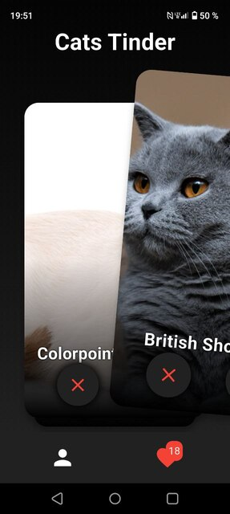
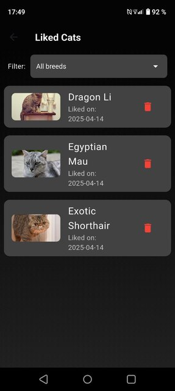
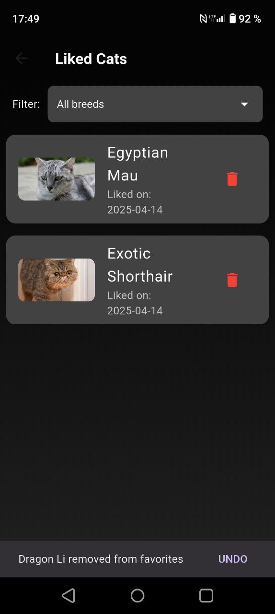
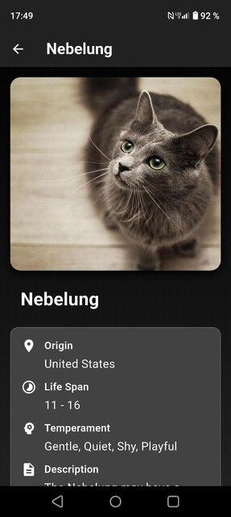
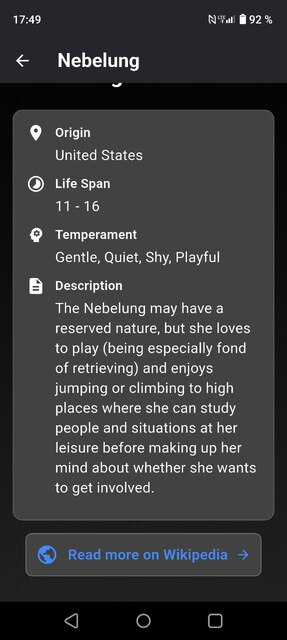
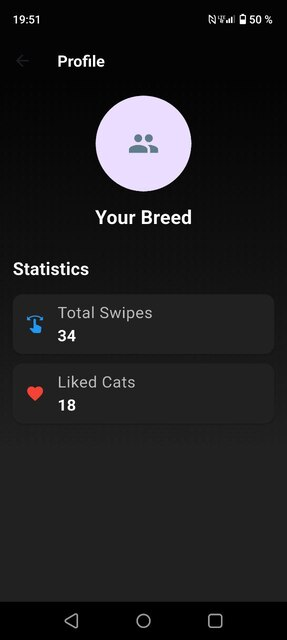

# Cats Tinder

Приложение представляет собой Тиндер для котиков.
Здесь вы можете проявлять свою симпатию к котикам, сохраняя их в "Понравившиеся".
Так же вы можете посмотреть статистику по количеству понравившихся котиков в профиле.

## Описание структуры

- `lib/data` -- Работа с данными
- `lib/domain` -- Доменный слой (бизнес-логика)
- `lib/presentation` -- Слой представления (UI + логика отображения)
- `di.dart` -- Подключение зависимостей

## Фичи
- Реализована аватарка для приложения через пакет `flutter_launcher_icons`
- Реализована карточка котика, которую можно свапать вправо (лайк) и влево (дизлайк) через пакет `flutter_card_swiper`. Так же можно просто нажать на кнопки лайка и дизлайка, чтобы проявить свою симпатию к котику. Обе кнопки сделаны с помощью `StatelessWidget`
- Используются виджеты `Row`, `Column`, `StatefulWidget`, `Navigator`, `Image`
- Код отформатирован с помощь `dart format`
- Подключен и используется `flutter_lint` (в pubspec.yaml и analysis_options.yaml)
- Команда `flutter analyze` выполняется успешно без проблем
- Зависимости подключаются с помощью `get_it` в `di.dart`
- Экран лайкнутых котиков отображает список с изображением, породой и датой лайка. На этом экране возможна фильтрация по породе. В списке есть возможность удаления карточки из списка. Снизу всплывает подсказка, с помощью которой можно отменить действие
- При длительной загрузке приложение показывает `progress bar`. Так же использован `CircularProgressIndicator` для отображения загрузки изображения
- Использовал `AlertDialog` для отображения ошибки сети. В возникающем дилаоге есть 2 кнопки - `Cancel` и `Retry`. 
- Управление состоянием через `Cubit` для всех экранов. 

## Визул приложения
![[progress]](./examples_inerface/[progress].jpg)

## Скачать .apk
[Скачать APK](https://github.com/KiriProg/Cats_Tinder/releases/latest/download/app-release.apk)
