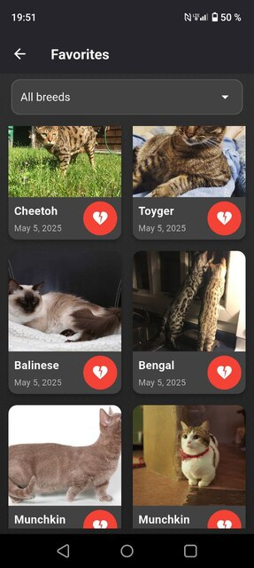
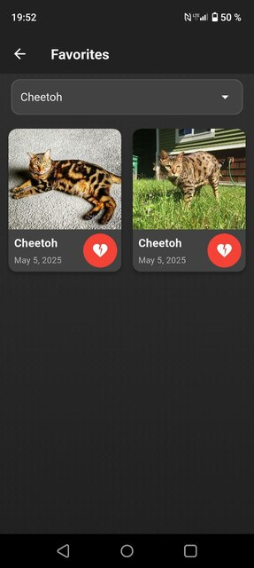
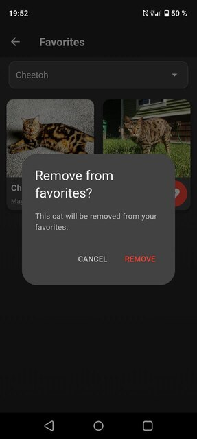
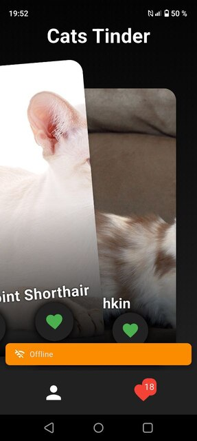
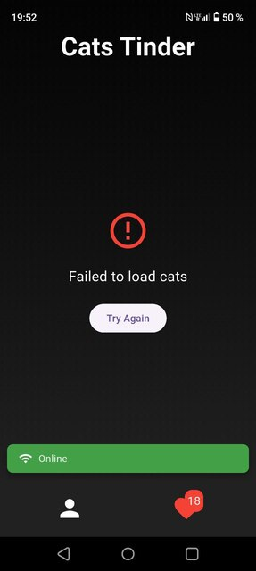
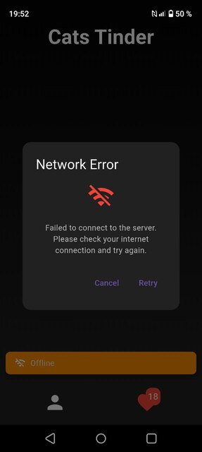
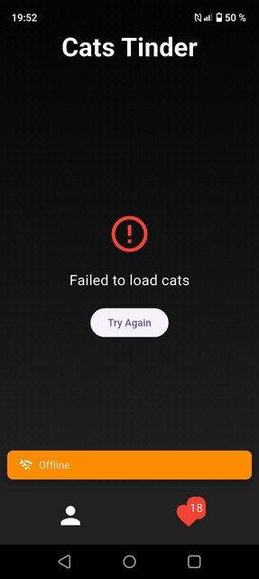

# Cats Tinder

Приложение представляет собой Тиндер для котиков.
Здесь вы можете проявлять свою симпатию к котикам, сохраняя их в "Понравившиеся".
Так же вы можете посмотреть статистику по количеству понравившихся котиков в профиле.
Приложение сохраняет данные даже после выхода и работает в оффлайне

## Описание структуры

- `lib/data` -- Работа с данными
- `lib/domain` -- Доменный слой (бизнес-логика)
- `lib/presentation` -- Слой представления (UI + логика отображения)
- `di.dart` -- Подключение зависимостей
- `test` -- unit-тестирование лайков/дизлайков 

## Фичи
- Реализована аватарка для приложения через пакет `flutter_launcher_icons`
- Реализована карточка котика, которую можно свапать вправо (лайк) и влево (дизлайк) через пакет `flutter_card_swiper`. Так же можно просто нажать на кнопки лайка и дизлайка, чтобы проявить свою симпатию к котику. Обе кнопки сделаны с помощью `StatelessWidget`
- Используются виджеты `Row`, `Column`, `StatefulWidget`, `Navigator`, `Image`
- Код отформатирован с помощь `dart format`
- Подключен и используется `flutter_lint` (в pubspec.yaml и analysis_options.yaml)
- Команда `flutter analyze` выполняется успешно без проблем
- Зависимости подключаются с помощью `get_it` в `di.dart`
- Экран лайкнутых котиков отображает список с изображением, породой и датой лайка. На этом экране возможна фильтрация по породе. В списке есть возможность удаления карточки из списка. Снизу всплывает подсказка, с помощью которой можно отменить действие
- При длительной загрузке приложение показывает `progress bar`. Так же использован `CircularProgressIndicator` для отображения загрузки изображения
- Использовал `AlertDialog` для отображения ошибки сети. В возникающем дилаоге есть 2 кнопки - `Cancel` и `Retry`. 
- Управление состоянием через `Cubit` для всех экранов. 
- Использование локального хранилища (`Drift` и `SharedPreferences`) для хранения лайкнутых котиков и количества свайпов
- Изображения кэшируются с помощью `cached_network_image`
- Заранее подгружается 10 карточек. Они сразу кэшируются, чтобы даже при отключении интернета пользователь не сильно грустил
- Написаны `unit-тесты` на стейт-менеджеры — на операции лайков и дизлайков
- Используется мокирование через `mocktail` для классов, работающих с API и с базой данных.
- Используется пакет `connectivity_plus` для проверки наличия сети.
- Используется `Snackbar` для отображения статуса сети - он имеет 2 состояния: есть сеть или её нет, чтобы уведомлять пользователя, что подключение восстановлено
- Когда нет сети — это отображается неблокирующим образом в интерфейсе
- Лайки/дизлайки сохраняются между выходами из приложения.
- Приложение работает в оффлайн-режиме: отображает ранее загруженных котиков.

## Особенности моего приложения
- Страница профиля, где можно посмотреть свою статистику
- Используется подписка на изменения состояния сети, для уведомления пользователя через `Snackbar`
- Есть подвтерждение уведомления котика из лайкнутых. Если всё же котик по ошибке удалён, его можно вернуть с помощью всплывающей подсказки

## Визул приложения

## Скачать .apk
[Скачать APK](https://github.com/KiriProg/Cats_Tinder/releases/latest/download/app-release.apk)
